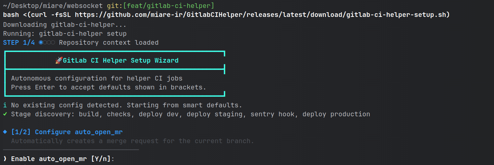
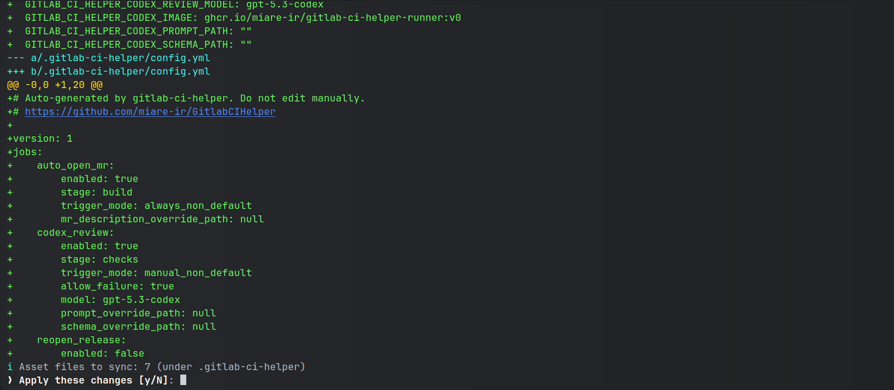
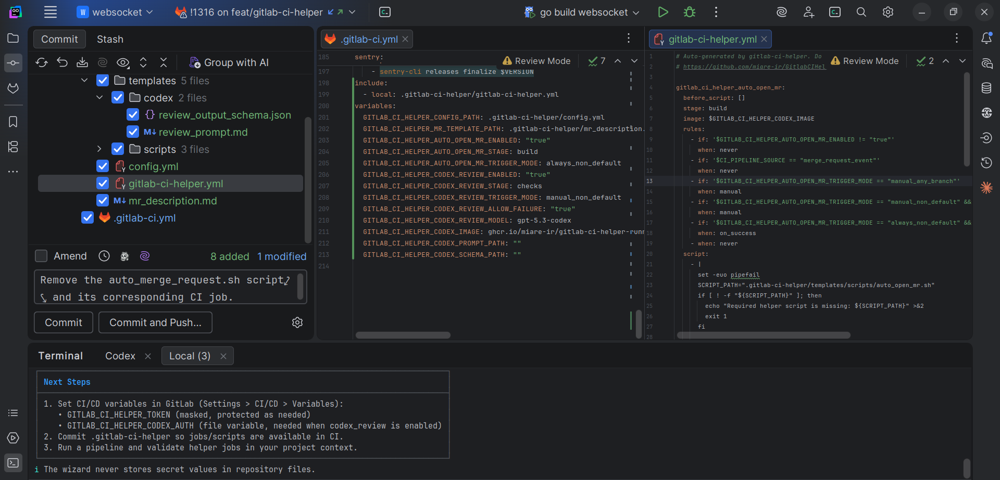
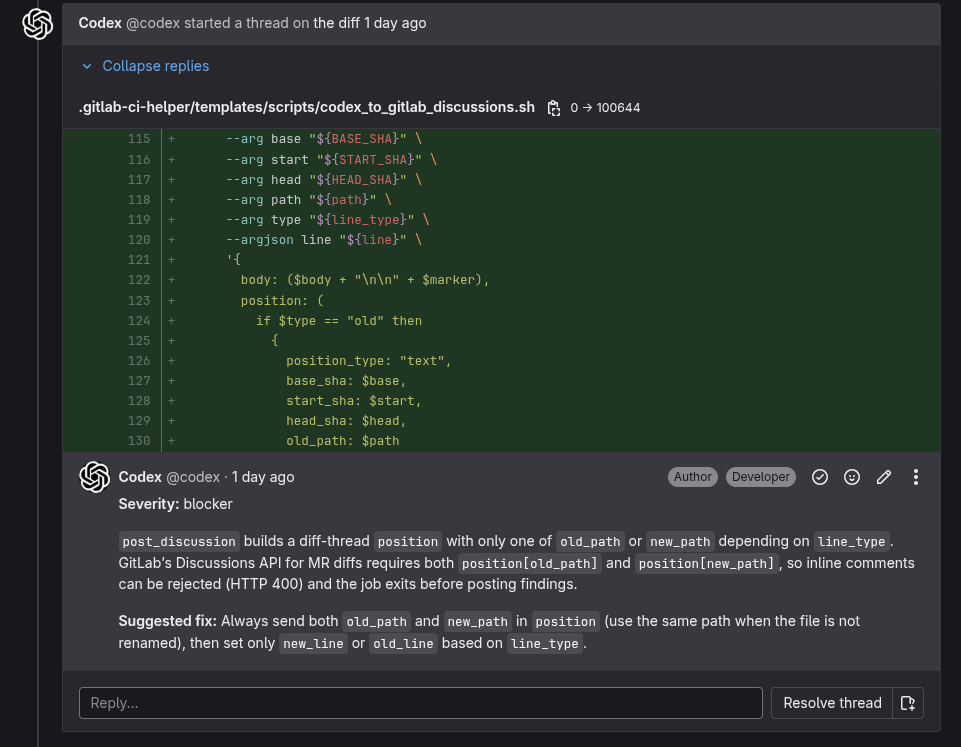

# gitlab-ci-helper

Open-source GitLab CI helper that adds automation jobs to your project through an interactive setup wizard.

`gitlab-ci-helper` is designed for teams that want reusable CI automation without manually editing complex pipeline YAML. It configures your repository once, then keeps the setup stable and repeatable.

## What it does

- Adds reusable helper jobs to your GitLab pipeline.
- Configures everything through an interactive `setup` wizard.
- Updates `.gitlab-ci.yml` idempotently (safe to run setup multiple times).
- Syncs required helper templates and scripts into `.gitlab-ci-helper/`.
- Supports these CI helper jobs:

| Job                             | What it does                                                                                                                                                                                              |
|---------------------------------|-----------------------------------------------------------------------------------------------------------------------------------------------------------------------------------------------------------|
| `gitlab_ci_helper_auto_open_mr` | Automatically creates or updates a merge request from your branch to the default branch based on your configured trigger mode. Useful for keeping branch-to-MR flow consistent with minimal manual steps. |
| `gitlab_ci_helper_codex_review` | Runs an AI-assisted code review for merge request changes and publishes structured feedback to GitLab discussions. Useful for fast first-pass review coverage before human review.                        |

## Install + quick start

Run this from the root of your GitLab repository (where `.gitlab-ci.yml` exists):

```bash
bash <(curl -fsSL https://github.com/miare-ir/GitlabCIHelper/releases/latest/download/gitlab-ci-helper-setup.sh)
```

The wizard will:

- inspect your local `.gitlab-ci.yml` include chain,
- ask for trigger/stage behavior per job,
- show a diff preview before applying,
- update `.gitlab-ci.yml` and `.gitlab-ci-helper/config.yml`,
- sync helper assets under `.gitlab-ci-helper/templates/`.

Commit `.gitlab-ci-helper/` to your repository so CI has access to the synced scripts/templates.

## Required CI/CD variables

Set these in GitLab: `Settings > CI/CD > Variables`.

| Variable                       | Description                                                                                                           |
|--------------------------------|-----------------------------------------------------------------------------------------------------------------------|
| `GITLAB_CI_HELPER_TOKEN`       | GitLab API token with project access                                                                                  |
| `GITLAB_CI_HELPER_CODEX_AUTH`  | File variable used by the Codex review job                                                                            |
| `GITLAB_CI_HELPER_CODEX_IMAGE` | Optional runner image override (default: same tag as the released helper binary, fallback `:v0` for local/dev builds) |

For reproducible pipelines, pin image tags to concrete versions (for example `ghcr.io/miare-ir/gitlab-ci-helper-runner:v0.1.0`).

## Screenshots

Add your screenshots under `docs/screenshots/` using the names below (or update the paths).






## Project links

- Releases: https://github.com/miare-ir/GitlabCIHelper/releases
- Contribution guide: `CONTRIBUTING.md`
